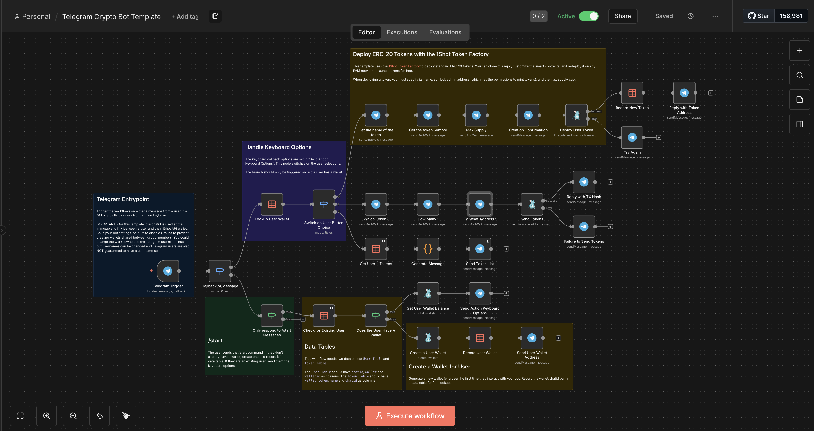

  

# Telegram Crypto Bot Templage

  

This n8n workflow shows you some patterns for creating fully-featured onchain Telegram bots like create EVM wallets for users as well as wallet and contract address overrides so users pay for their own transactions from your bot. 